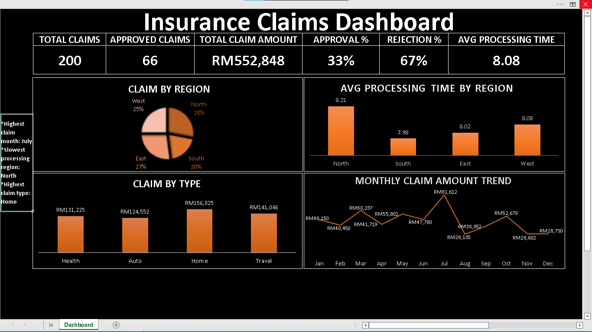

# Errynie Cyril — Data Analytics Portfolio

Hi, I'm **Errynie Cyril**, a Data Analyst with 2+ years of professional experience turning raw data into clear, actionable insights. I specialize in Excel dashboards, SQL data validation, and Python automation. This portfolio showcases projects I've built independently — from freelance dashboards to data verification systems.

📧 erryniec26@gmail.com · 🔗 [LinkedIn](http://www.linkedin.com/in/erryniecyril) · 📍 Kuala Lumpur, Malaysia

---

## Projects

---

### 1. Sales Performance Dashboard
**Tools:** Excel (Pivot Tables, Slicers, Power Query) · Data Visualization · KPI Tracking

A fully interactive Excel dashboard analyzing 2025 annual sales data across products, regions, and salespersons.

**Key Metrics:**
- 💰 Total Revenue: **RM 16,241,335**
- 📦 Units Sold: **15,898**
- 🔁 Total Transactions: **1,500**
- 🏆 Top Product: **Camera** (RM 2,027,549)
- 📍 Top Region: **West** (RM 3,570,051)

**What it does:**
- Interactive slicers for Product, Salesperson, Region, and Month
- Revenue breakdown by product, region, month, and salesperson
- Dynamic KPI summary that updates based on slicer selections
- Built entirely from scratch as a freelance project

📁 [View Project Files](sales-dashboard/)

---

### 2. Insurance Claims Dashboard
**Tools:** Excel · KPI Reporting · Trend Analysis · Data Visualization

An analytics dashboard built to track and monitor insurance claims performance, approval rates, and processing efficiency across regions.

**Key Metrics:**
- 📋 Total Claims: **200**
- ✅ Approved Claims: **66** (33% approval rate)
- ❌ Rejection Rate: **67%**
- 💰 Total Claim Amount: **RM 552,848**
- ⏱️ Avg Processing Time: **8.08 days**
- 🏠 Highest Claim Type: **Home** (RM 156,025)

**What it does:**
- KPI summary row showing approval, rejection, and processing metrics
- Claims breakdown by region and claim type
- Monthly claim amount trend line to identify peak periods
- Identified July as highest claim month and North as slowest processing region

📁 [View Project Files](insurance-claims-dashboard/)

---

### 3. Freelance Transaction Analysis + Automation
**Tools:** Excel · Python · SQLite · Data Cleaning · Automation

A combined analytical and automation project built around a real freelance transaction dataset.

**Two parts:**
- **Transaction Analysis** — Analyzed 1,500+ transaction records to identify revenue trends and product performance using pivot tables and charts
- **Dashboard Automation** — Python script that reads CSV/SQLite data, cleans it automatically, and outputs a cleaned CSV ready for dashboard updates

**What it does:**
- Automates repetitive data cleaning steps
- Reduces manual effort for recurring reporting tasks
- Demonstrates end-to-end workflow: raw data → cleaned data → dashboard-ready output

📁 [View Project Files](freelance-transaction-automation/)

---

### 4. SQL Data Verification Project
**Tools:** SQL · Data Validation · Joins · Aggregation

A data quality project focused on verifying 500+ transaction records for consistency and accuracy.

**What it does:**
- Used LEFT JOIN and INNER JOIN to cross-check records across tables
- Applied aggregations and filters to surface discrepancies
- Documented findings for audit trail and reporting purposes

**Skills demonstrated:** Data validation, query writing, anomaly detection

📁 [View Project Files](sql-verification/)

---

## Skills

| Category | Tools |
|---|---|
| Data Analysis | Excel, Pivot Tables, Power Query |
| Visualization | Excel Charts, KPI Dashboards |
| Database | SQL (Joins, Aggregations, Validation) |
| Automation | Python, SQLite, CSV Processing |
| Reporting | KPI Tracking, Trend Analysis |

---

## About Me

I have 2+ years of experience as a Data Analyst, including a hybrid role at AS White Global (KL) handling large datasets, stakeholder reporting, and dashboard development. I enjoy building things from scratch — these projects were all self-initiated, not assigned.

Currently expanding into BI development and Power BI.
