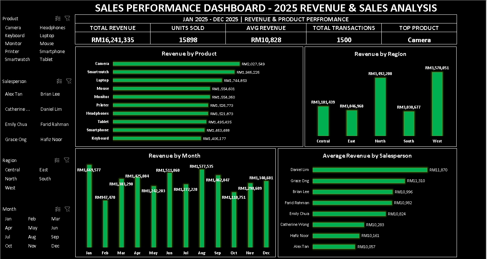

# Errynie Cyril Portfolio

Hi! I’m **Errynie Cyril**, a detail-oriented Data & Operations professional with 2+ years of experience handling high-volume records, building automated dashboards, and validating complex datasets. I specialize in SQL, Excel, and KPI reporting, and I’m passionate about turning raw data into actionable insights that drive better business decisions. This portfolio showcases my key projects demonstrating analysis, automation, and visualization skills.

---

## **Projects**

### 1. Sales & Transaction Dashboard

- Built an Excel dashboard to track product performance, revenue, and units sold.
- Includes pivot tables, charts, and automated KPIs.
- **File:** `sales-dashboard/dashboard.xlsx`  
- Skills demonstrated: Excel (Pivot Tables, Power Query), Data Visualization, KPI Tracking

---

### 2. SQL Data Verification Project
- Verified 500+ transaction records for consistency and discrepancies.
- Used SQL LEFT/INNER JOINs, aggregations, and filtering to validate data.
- **Files:**  
  - `sql-verification/sample-data.csv` – sample dataset  
  - `sql-verification/verification-scripts.sql` – SQL scripts for data validation  
- Skills demonstrated: SQL, Data Validation, Joins, Aggregation

---

### 3. Freelance Transaction Analysis
- Analyzed 1,500+ transaction records to identify revenue trends and product performance.
- Built summary tables, pivot charts, and derived actionable insights.
- **File:** `freelance-analysis/transactions.csv`  
- Skills demonstrated: Excel, Data Analysis, Reporting

---

### 4. Dashboard Automation
- Automated cleaning, aggregation, and reporting of transaction data.
- Python script reads CSV/SQLite, cleans data, and outputs cleaned CSV for dashboard updates.
- **Files:**  
  - `dashboard-automation/automation.py` – Python automation script  
  - `dashboard-automation/dashboard.xlsx` – placeholder for automated dashboard  
- Skills demonstrated: Python, SQL, Data Cleaning, Automation

---

## **Contact**
- Email: erryniec26@gmail.com  
- Location: Kuala Lumpur, Malaysia  
